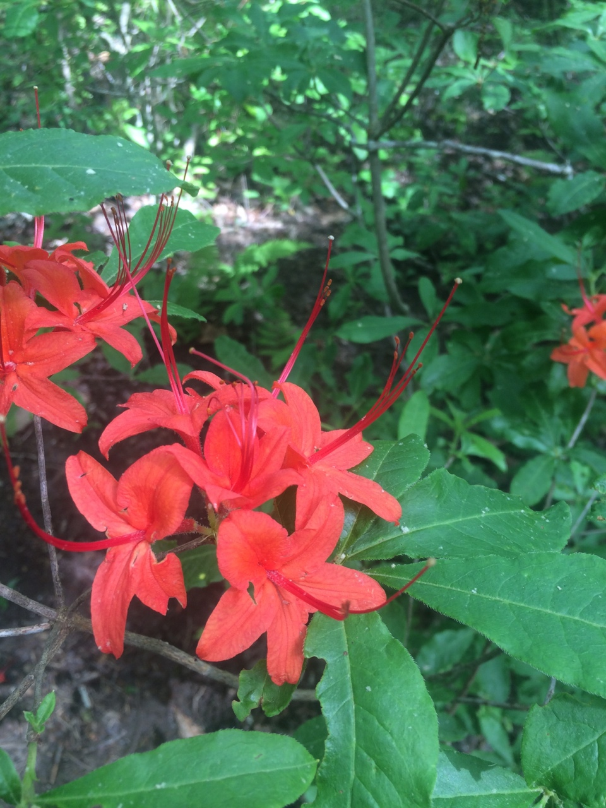
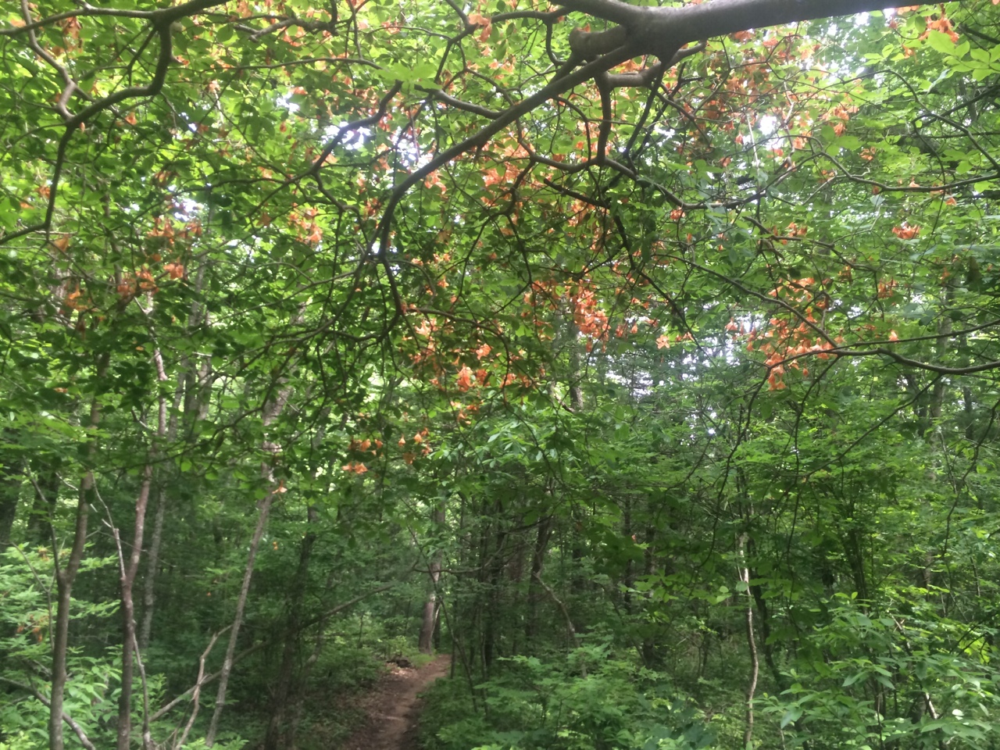
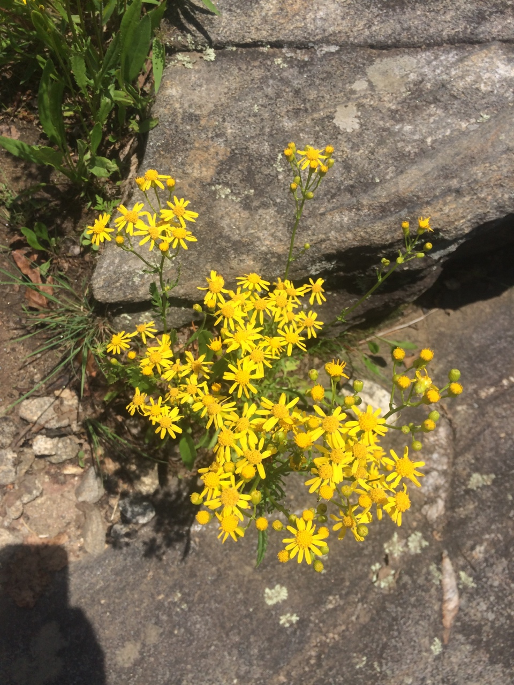
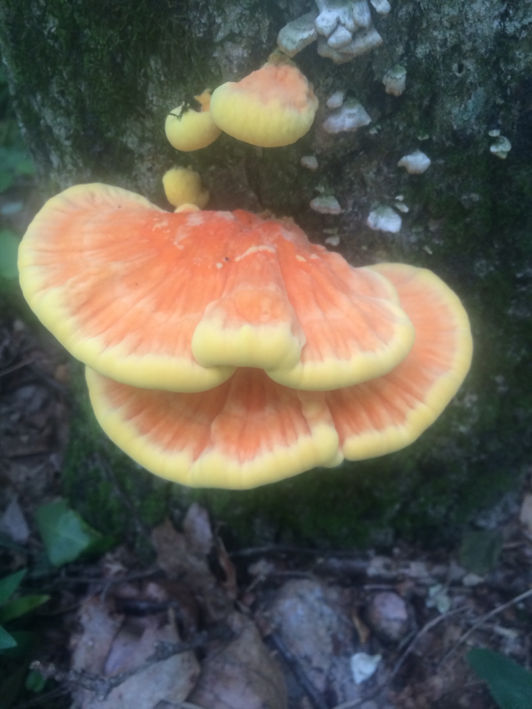
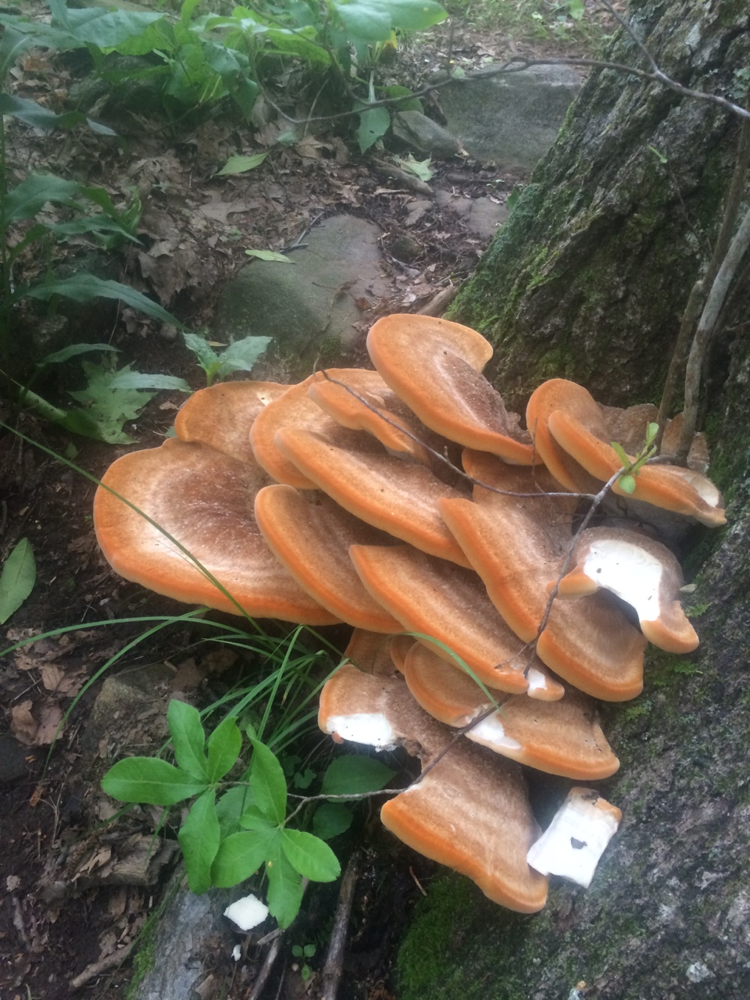
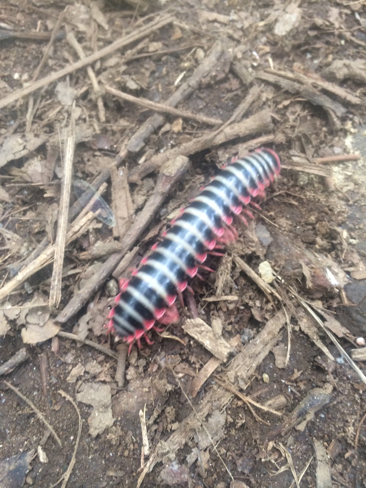
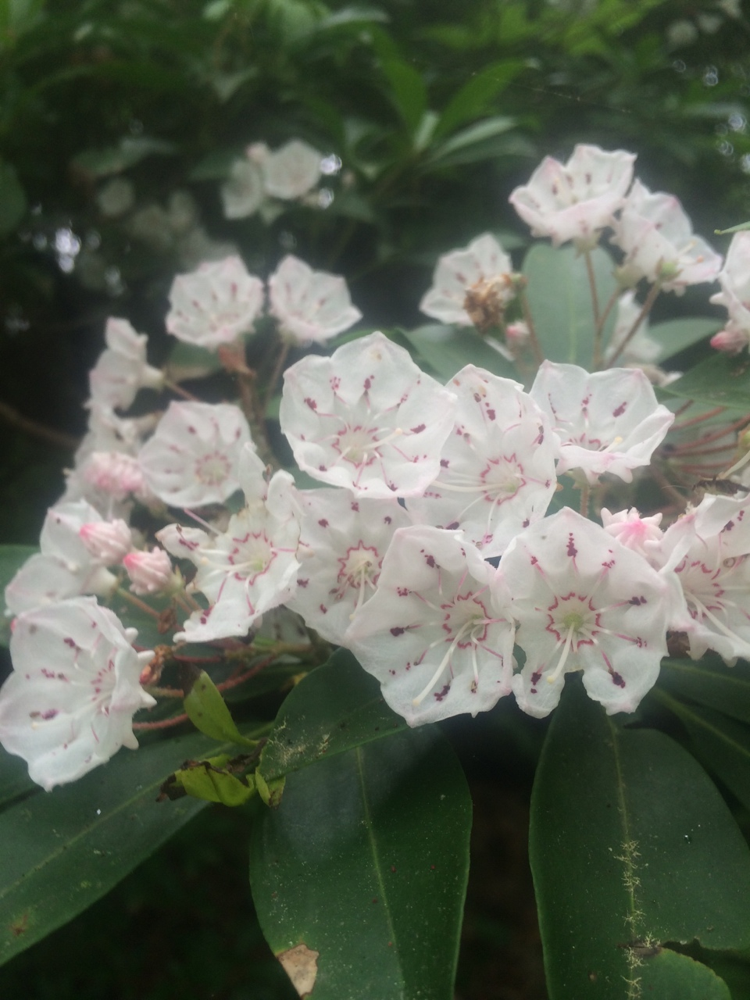
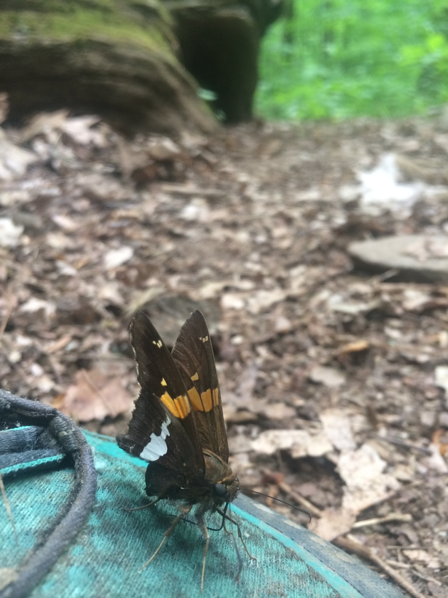
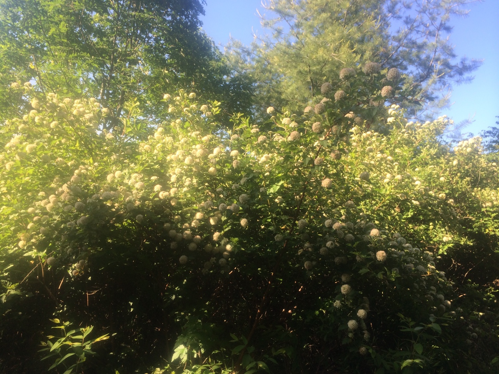
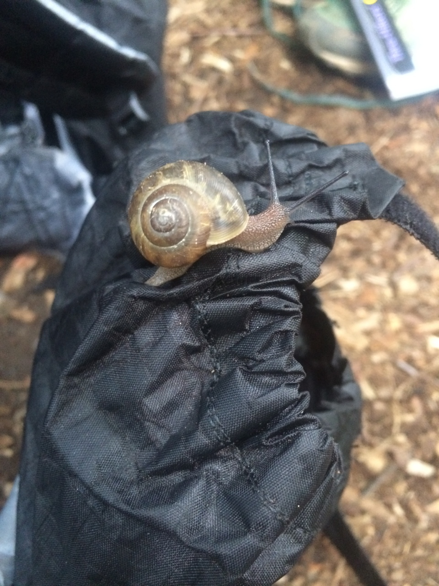

## Photos Part 1: Flora and fauna (if you can identify any of these, let me know! I’d love to know what exactly I’m looking at all day)

Originally posted on June 4th, 2014 8:27pm

```{r, out.width = "100%", echo = FALSE}










```

